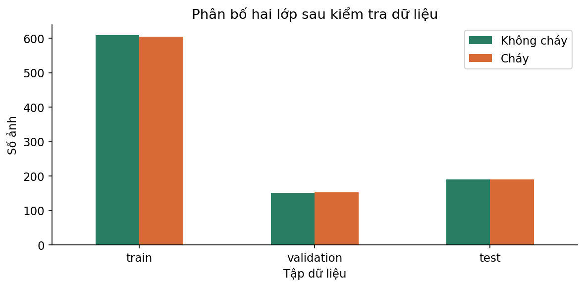
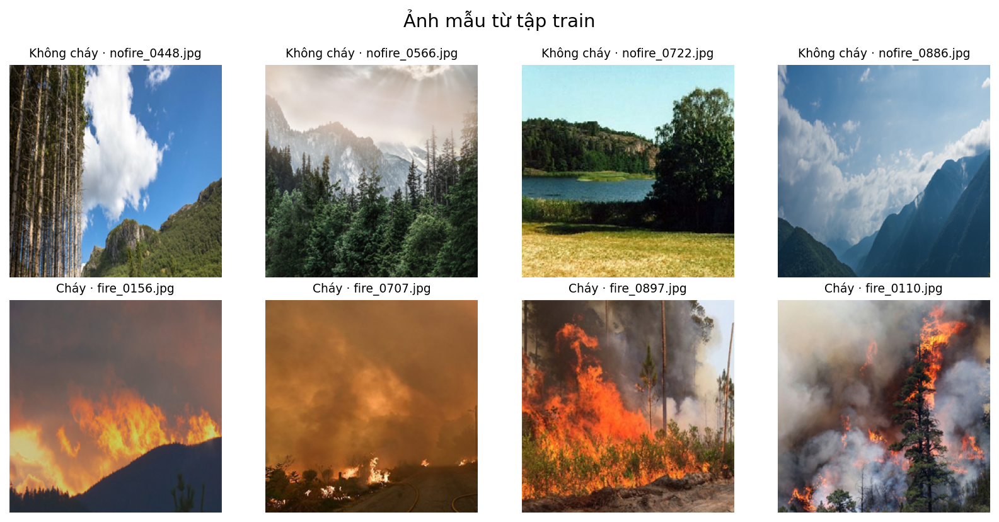
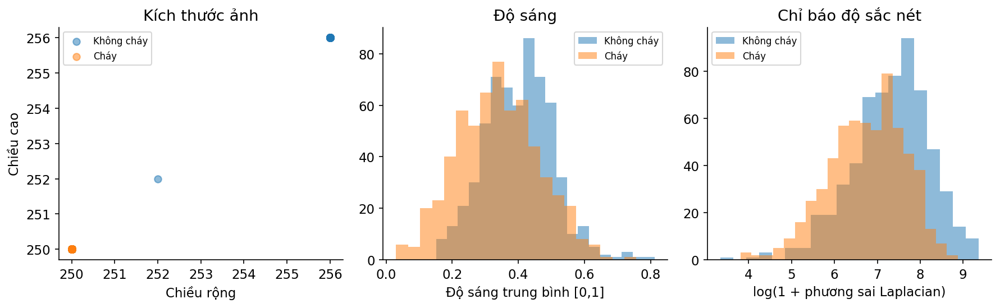
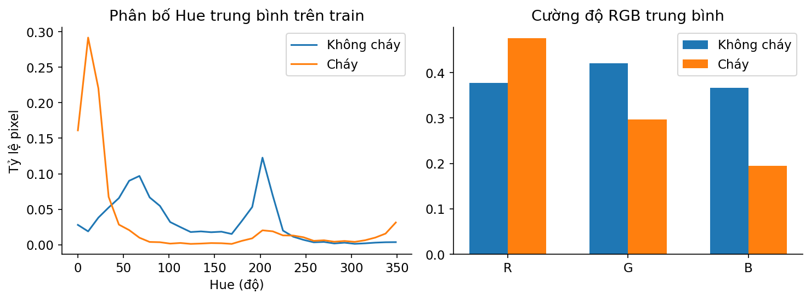
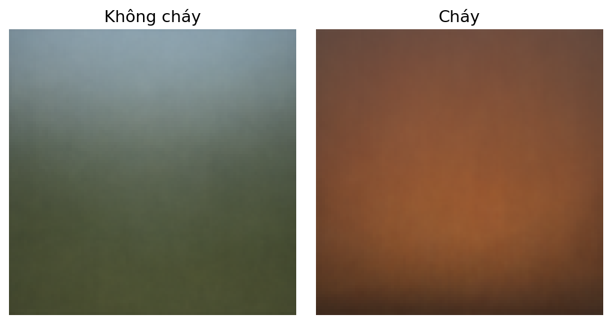
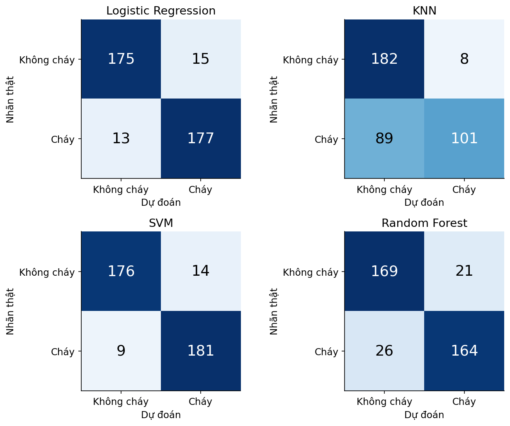
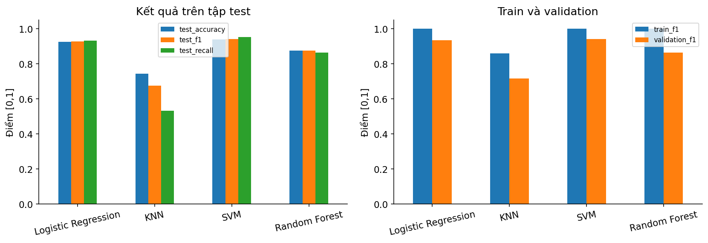
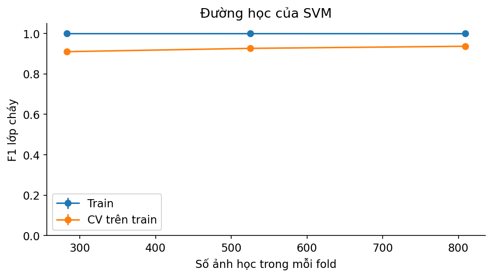
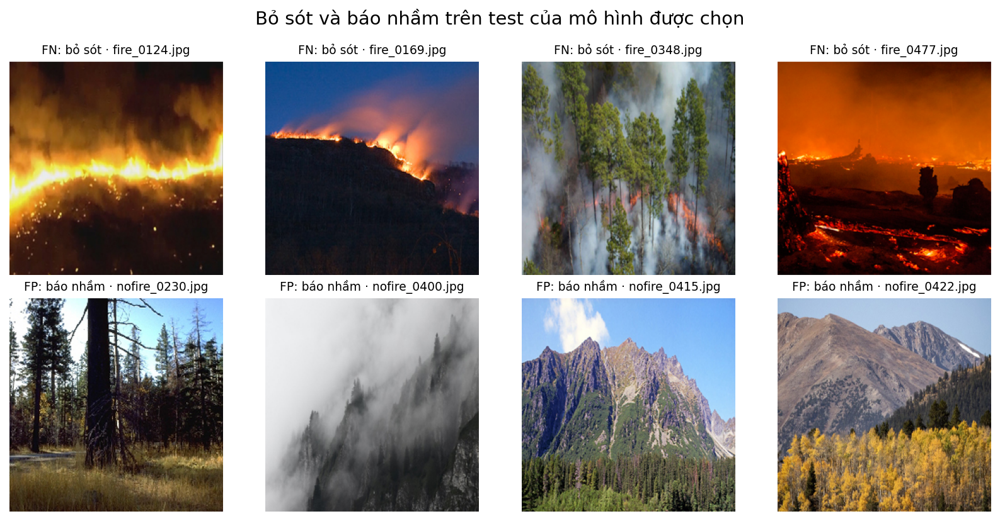

# Ứng dụng các thuật toán học máy trong phân loại ảnh cháy rừng
ĐỒ ÁN MÔN HỌC MÁY HỌC
Forest Fire Image Classification using Machine Learning Algorithms
Thực nghiệm ngày 17 tháng 9 năm 2026

## 1 Tóm tắt đề tài

Đồ án so sánh Logistic Regression, KNN, SVM và Random Forest trên bộ DeepFire để phân loại toàn ảnh thành cháy hoặc không cháy. Ảnh được biểu diễn bằng histogram màu HSV và HOG, sau đó chuẩn hóa và giảm chiều bằng PCA. Mô hình được chọn theo F1 lớp cháy trên validation, trước khi đánh giá test.

Sau kiểm tra dữ liệu, sử dụng 1.896 ảnh, gồm 1.213 train, 303 validation và 380 test. SVM đạt F1 validation 94,19%. Trên test, SVM đạt Accuracy 93,95%, Precision 92,82%, Recall 95,26% và F1 94,03%. Mô hình vẫn bỏ sót 9 ảnh cháy và báo nhầm 14 ảnh không cháy.

Kết quả hỗ trợ lựa chọn mô hình cho bộ ảnh này. Chưa có thử nghiệm camera trực tiếp, dữ liệu theo thời gian hoặc đánh giá địa điểm mới, nên chưa kết luận hệ thống phát hiện sớm hay hoạt động ổn định ngoài thực tế.

## Nội dung báo cáo

1. Tóm tắt đề tài
2. Giới thiệu bài toán và dataset
3. EDA và biểu đồ
4. Tiền xử lý dữ liệu
5. Mô hình và thông số
6. Kết quả và phân tích
7. So sánh mô hình
8. Kết luận
9. Hướng phát triển
10. Phụ lục mã nguồn

# 2 Giới thiệu bài toán và dataset
Đầu vào là một ảnh RGB. Đầu ra là nhãn 1 (cháy) hoặc 0 (không cháy). “Phát hiện” ở đây là xác định sự hiện diện trong cả ảnh, chưa khoanh vùng bằng bounding box. Nhãn Fire/No Fire lấy từ dữ liệu nguồn; không tự mở rộng lớp Fire thành mọi ảnh có khói.

Bộ dữ liệu: DeepFire / Forest Fire Dataset, tác giả A. Khan và cộng sự, phân phối trên Kaggle bởi alik05 [1]. Dataset card công bố 1.900 ảnh, 950 ảnh mỗi lớp, thu thập bằng tìm kiếm Internet và biên tập vùng ảnh phù hợp; giấy phép CC BY 4.0. Không gán nguồn camera/drone cho từng ảnh khi chưa có metadata.

| Tập nguồn | Không cháy | Cháy | Tổng |
|---|---|---|---|
| Training | 760 | 760 | 1520 |
| Testing | 190 | 190 | 380 |
| Tổng | 950 | 950 | 1900 |

Nhãn đọc theo tên file nofire_ và fire_, tương ứng 0 và 1. Đây là sử dụng nhãn của tác giả, không phải gán nhãn tự động bằng dự đoán. Tất cả 1.900 ảnh đọc được; không phát hiện file ảnh hỏng trong lần kiểm tra này.

| Tập thực nghiệm | Không cháy | Cháy | Tổng |
|---|---|---|---|
| train | 609 | 604 | 1213 |
| validation | 151 | 152 | 303 |
| test | 190 | 190 | 380 |

Loại 2 ảnh trùng pixel và 2 ảnh Training thuộc nhóm gần trùng với Testing. Giữ nguyên 380 ảnh test. Tách khoảng 20% Training còn lại làm validation bằng StratifiedGroupKFold, seed 42. Các nhóm dHash không giao nhau giữa ba tập. Phân bố hai lớp gần 1:1 nên không dùng SMOTE hoặc cân bằng nhân tạo.

dHash khoảng cách ≤4 chỉ là cách nhóm ảnh gần giống. Thiếu mã sự kiện/địa điểm nên chưa chứng minh độc lập theo vụ cháy. Danh sách ảnh và nhóm lưu trong data_manifest.csv; ảnh bị loại được lưu riêng để truy vết.

# 3 EDA và biểu đồ
EDA kiểm tra số ảnh mỗi lớp, ảnh mẫu, kích thước, độ sáng, độ sắc nét và màu sắc. Các phân tích hình ảnh dùng train để tránh sử dụng test khi quyết định đặc trưng. Biểu đồ phân bố nhãn trình bày cả ba tập để kiểm tra cách chia.

Ảnh cháy có nhiều dạng: lửa rõ, khói che một phần hoặc vùng cháy nhỏ. Ảnh không cháy có nền rừng, núi, bầu trời và màu sắc khác nhau. Không dùng một ngưỡng màu đỏ duy nhất để thay thế mô hình học.

# 3 EDA về màu sắc và chất lượng ảnh

Trong toàn bộ 1.896 ảnh giữ lại, có 1.822 ảnh 250×250, 1 ảnh 252×252 và 73 ảnh 256×256. Vì vậy vẫn cần resize thống nhất. Độ sáng là trung bình ảnh xám trên [0,1]; phương sai Laplacian là chỉ báo độ sắc nét, không phải nhãn “mờ/rõ” do con người xác nhận.

Trên train, lớp cháy tập trung nhiều pixel Hue ở vùng màu ấm và có cường độ đỏ trung bình cao hơn. Tuy nhiên, phân bố vẫn chồng lấn; lửa nhỏ có thể bị nền ảnh lấn át, còn cảnh không cháy vẫn có thể mang màu ấm.

Ảnh trung bình mô tả xu hướng tổng hợp. Các ảnh không được căn theo cùng vị trí vật thể nên không suy ra vị trí thường xuất hiện của đám cháy từ hình này.

# 4 Tiền xử lý dữ liệu
| Bước | Thực hiện | Mục đích |
|---|---|---|
| Kiểm tra file | Đọc ảnh, kiểm tra nhãn, kích thước | Phát hiện lỗi đầu vào |
| Trùng và gần trùng | SHA256 pixel; dHash 64 bit, ngưỡng 4 | Giảm ảnh tương tự giữa các tập |
| Chuẩn hóa ảnh | EXIF orientation, RGB, resize 96×96, chia 255 | Tạo đầu vào đồng nhất |
| Màu sắc | Histogram HSV: 32 + 16 + 16 bins | 64 đặc trưng phân bố màu |
| Hình dạng | HOG: 8 hướng, cell 16×16, block 2×2 | 800 đặc trưng hướng cạnh |
| Ghép và chuẩn hóa | Ghép 864 chiều; StandardScaler | Đưa các đặc trưng về thang đo phù hợp |
| Giảm chiều | PCA giữ 95% phương sai train | 231 thành phần khi fit trên toàn train |

HOG mô tả hướng cạnh trong các vùng nhỏ, không trực tiếp hiểu “lửa” hoặc “khói”. PCA là phép biến đổi giảm chiều của vector đặc trưng. Giữ 95% phương sai không có nghĩa giữ 95% thông tin phân loại hoặc đạt 95% Accuracy.

Trong cross-validation, StandardScaler và PCA được fit lại chỉ bằng phần train của từng fold. Validation và test chỉ đi qua transform. Đặt hai phép biến đổi trong Pipeline để tránh rò rỉ dữ liệu [2]. Số thành phần PCA có thể khác giữa các fold.

Không tạo ảnh giả và không tăng cường dữ liệu trong thực nghiệm này. Không điền pixel cho file hỏng; nếu có file hỏng sẽ ghi danh sách và loại có kiểm soát. Không dùng SMOTE do phân bố lớp gần cân bằng. Nhãn được mã hóa bằng hai số nguyên 0/1.

Cùng một biểu diễn sau chuẩn hóa và PCA được dùng cho cả bốn mô hình. Lựa chọn này giúp đối chứng đầu vào nhưng chưa tối ưu riêng cho Random Forest; cần thêm thử nghiệm bỏ PCA để biết ảnh hưởng đối với mô hình cây.

# 5 Mô hình và thông số
| Mô hình | Ý tưởng | Tham số được chọn |
|---|---|---|
| Logistic Regression | Kết hợp tuyến tính các đặc trưng; sigmoid cho điểm lớp cháy | C=1; lbfgs; max_iter=3000 |
| KNN | Bỏ phiếu theo các ảnh gần nhất trong không gian đặc trưng | k=3; uniform; Euclidean |
| SVM | Tìm ranh giới có biên lớn; kernel RBF cho ranh giới phi tuyến | C=10; kernel=rbf; gamma=scale |
| Random Forest | Nhiều cây học trên các mẫu và tập đặc trưng con | 150 cây; max_depth=None; min_samples_leaf=1 |

Không gian tìm kiếm: Logistic Regression C ∈ {0,1; 1; 10}; KNN k ∈ {3; 5; 9}, weights ∈ {uniform; distance}; SVM C ∈ {1; 10}, kernel ∈ {linear; rbf}; Random Forest max_depth ∈ {12; None}, min_samples_leaf ∈ {1; 2}. Các tham số khác giữ mặc định scikit-learn 1.7.2.

Mỗi cấu hình được đánh giá bằng 3-fold StratifiedGroupKFold trên 1.213 ảnh train. Tiêu chí chọn tham số là F1 lớp cháy trung bình qua các fold. Sau đó fit lại cấu hình tốt nhất trên toàn train, so sánh bốn mô hình trên validation và chọn F1 cao nhất; nếu hòa thì xét Recall.

| Mô hình | F1 CV trung bình | Độ lệch chuẩn | Thời gian tìm tham số |
|---|---|---|---|
| Logistic Regression | 93,79% | 1,06 điểm | 4.1 giây |
| KNN | 75,05% | 2,93 điểm | 5.7 giây |
| SVM | 93,66% | 0,46 điểm | 4.2 giây |
| Random Forest | 88,36% | 1,57 điểm | 21.3 giây |

Chốt SVM trước khi xem test; lưu selection_before_test.json. Không gộp lại validation vào train sau lựa chọn, nên các bảng train/validation/test cùng mô tả một bản mô hình. Thời gian tìm kiếm có sử dụng cache bước tiền xử lý và phụ thuộc máy chạy; không dùng nó để kết luận mô hình nào luôn nhanh hơn.

# 6 Kết quả và phân tích
Mọi mô hình được đánh giá trên cùng 380 ảnh test, cân bằng 190 ảnh mỗi lớp. Precision, Recall và F1 bên dưới đều tính riêng lớp cháy. Accuracy là tỷ lệ toàn bộ ảnh dự đoán đúng. Mô hình luôn dự đoán lớp phổ biến có Accuracy 50%, F1 lớp cháy 0% trong lần chạy này.

| Mô hình | Accuracy | Precision | Recall | F1 |
|---|---|---|---|---|
| Logistic Regression | 92,63 | 92,19 | 93,16 | 92,67 |
| KNN | 74,47 | 92,66 | 53,16 | 67,56 |
| SVM | 93,95 | 92,82 | 95,26 | 94,03 |
| Random Forest | 87,63 | 88,65 | 86,32 | 87,47 |

Đơn vị: %. Precision = TP/(TP+FP); Recall = TP/(TP+FN); F1 = 2×Precision×Recall/(Precision+Recall). TP là ảnh cháy được báo đúng, FP là ảnh không cháy bị báo cháy, FN là ảnh cháy bị bỏ sót.

SVM: TN=176, FP=14, FN=9, TP=181. Mô hình bỏ sót 4,74% trong 190 ảnh cháy và báo nhầm 7,37% trong 190 ảnh không cháy. Đây là tỷ lệ trên bộ test tĩnh, chưa đo tỷ lệ cảnh báo theo thời gian của camera.

# 7 So sánh mô hình
| Mô hình | F1 train | F1 validation | Chênh train và val |
|---|---|---|---|
| Logistic Regression | 100,00 | 93,42 | 6,58 |
| KNN | 86,06 | 71,54 | 14,51 |
| SVM | 100,00 | 94,19 | 5,81 |
| Random Forest | 100,00 | 86,45 | 13,55 |

Đơn vị: % cho F1 và điểm phần trăm cho chênh lệch. SVM đạt F1 validation 94,19%, cao hơn Logistic Regression 0,77 điểm. Trên test, SVM cũng cao nhất với F1 94,03%, hơn Logistic Regression 1,36 điểm, Random Forest 6,56 điểm và KNN 26,47 điểm.

SVM có cả Precision và Recall test cao hơn Logistic Regression trong lần chạy này. Chênh Accuracy chỉ 1,32 điểm, tương ứng 5 ảnh đúng hơn trên 380 ảnh, nên không kết luận ưu thế luôn lặp lại ở mọi bộ dữ liệu hoặc seed.

Giải thích có thể kiểm chứng: kernel RBF phù hợp quan hệ phi tuyến của bộ đặc trưng hiện tại. KNN chỉ tìm được 101/190 ảnh cháy dù Precision cao, cho thấy bỏ sót nhiều. Khoảng cách trong không gian nhiều chiều có thể là một yếu tố; đây là giả thuyết, cần đối chứng đặc trưng và giảm chiều.

Random Forest không tốt nhất trong thực nghiệm này. PCA xoay đặc trưng và giữ phương sai có thể không thuận lợi cho cây phân chia từng chiều. Chưa chạy đối chứng không PCA nên chưa kết luận nguyên nhân chắc chắn.

# 7 Đánh giá học quá khớp và đường học

F1 train của SVM, Logistic Regression và Random Forest đều đạt 100%. F1 validation lần lượt là 94,19%, 93,42% và 86,45%. Khoảng cách 5,81; 6,58 và 13,55 điểm cho thấy dấu hiệu học quá khớp, rõ hơn ở Random Forest. Không dùng điểm train cao để coi mô hình đã hoàn hảo.

Đường học SVM chỉ dùng train và các fold có nhóm. Với khoảng 283, 525 và 809 ảnh học trong mỗi fold, F1 CV trung bình tăng từ 91,00% lên 92,62% rồi 93,66%, trong khi F1 train vẫn 100%. Kết quả gợi ý thêm dữ liệu có thể hữu ích, nhưng chưa đo được mức tăng với dữ liệu mới.

KNN có F1 train 86,06% và validation 71,54%. Điểm train chưa cao và chênh lệch vẫn lớn cho thấy biểu diễn/khoảng cách hoặc cấu hình chưa phù hợp; không đủ căn cứ gắn duy nhất nhãn underfitting. Cần thử riêng histogram, HOG và PCA bằng validation.

Báo cáo không tuyên bố “khắc phục triệt để overfitting” bằng một giá trị max_depth. Các mô hình đã thử tham số trong phạm vi nêu ở mục 5. Muốn đánh giá ổn định hơn cần lặp nhiều cách chia theo nhóm hoặc bổ sung tập độc lập.

# 7 Phân tích ảnh dự đoán sai

Quan sát trực tiếp: fire_0169 có dải lửa trên sườn tối; fire_0348 có cây và khói che một phần lửa. fire_0124 và fire_0477 vẫn có lửa rõ nhưng bị bỏ sót. Vì vậy không giải thích mọi FN là “lửa nhỏ” hay “ảnh mờ”.

Các FP minh họa gồm nofire_0400 có sương hoặc mây trắng trên cây, nofire_0422 có lá vàng; nofire_0230 và nofire_0415 là cảnh rừng/núi không có lửa rõ. Nhãn gốc được giữ nguyên. Các tình huống cho thấy màu và kết cấu có thể gây nhầm, nhưng chưa xác định được đặc trưng nào gây lỗi từng ảnh.

| Nhóm kết quả SVM | Số ảnh | Độ sáng TB | Độ sắc nét TB |
|---|---|---|---|
| Đúng | 357 | 0,371 | 1.686,2 |
| FN bỏ sót | 9 | 0,322 | 559,2 |
| FP báo nhầm | 14 | 0,376 | 1.573,2 |

Độ sáng được chuẩn hóa [0,1]. Độ sắc nét là phương sai Laplacian sau resize. Nhóm FN có trung bình tối hơn và chỉ báo sắc nét thấp hơn, nhưng chỉ gồm 9 ảnh. Không suy ra quan hệ nhân quả hoặc dùng chỉ báo này như nhãn chất lượng đã kiểm chứng.

# 8 Kết luận
Đồ án hoàn thành quy trình từ kiểm tra dữ liệu ảnh, EDA, trích đặc trưng đến so sánh bốn thuật toán cơ bản. Các kết quả đều có nhãn dự đoán, tham số, file mô hình và danh sách chia tập để kiểm tra lại.

SVM với kernel RBF, C=10 được chọn theo validation và đạt F1 test 94,03%, Recall 95,26%, Accuracy 93,95%. Trong phạm vi bộ DeepFire và biểu diễn HSV+HOG+PCA, đây là lựa chọn tốt nhất trong bốn mô hình đã thử. Logistic Regression là đối chứng cạnh tranh với F1 92,67%.

Mô hình vẫn có 23 lỗi test. Dữ liệu cân bằng và đã được tuyển chọn từ Internet khác với camera thực tế, nơi ảnh không cháy thường chiếm đa số. Chưa đánh giá vùng địa lý mới, sự kiện mới, video, độ trễ đầu cuối hoặc tình huống cháy rất sớm. Không coi kết quả là hệ thống cảnh báo đã sẵn sàng triển khai.

## 9 Hướng phát triển

1. Thu thập bộ kiểm thử độc lập theo camera, địa điểm hoặc vụ cháy. Giữ nguyên bộ này trong quá trình chỉnh mô hình.
2. Thử nghiệm bỏ từng thành phần HSV, HOG, PCA để đo đóng góp. Với Random Forest, thử đặc trưng gốc không PCA.
3. Bổ sung ảnh khó: sương mù, lá vàng, đèn, lửa xa và cảnh ban đêm. Kiểm tra nhãn bởi người xem.
4. Nếu thay ngưỡng báo cháy, chọn ngưỡng bằng validation và báo cáo đánh đổi giữa báo nhầm và bỏ sót.
5. Muốn nhận diện riêng khói cần nhãn khói; muốn khoanh vùng cần bounding box hoặc mask. Sau đó mới thử mô hình detection/segmentation.
6. Đo thời gian đọc ảnh, trích đặc trưng và dự đoán trên thiết bị đích; kết hợp nhiều khung hình khi làm demo video.

# 10 Phụ lục mã nguồn và tái lập
| Tệp | Nội dung |
|---|---|
| src/experiment.py | Tải dữ liệu, audit, EDA, đặc trưng, tìm tham số và đánh giá |
| src/predict.py | Phân loại một ảnh bằng mô hình được chọn |
| notebooks/MayHoc_Chay_rung.ipynb | Notebook tự chứa toàn bộ mã; có output lần chạy |
| results/data_manifest.csv | Đường dẫn, nhãn, nhóm và tập của từng ảnh |
| results/model_metrics.csv | Các chỉ số train, validation, test của bốn mô hình |
| results/predictions.csv | Nhãn thật và dự đoán của từng ảnh |
| results/cv_*.csv | Mọi cấu hình và kết quả cross-validation |
| results/verification.json | Kiểm tra chia tập và tính lại chỉ số từ dự đoán |
| models/*.joblib | Bốn Pipeline đã fit, gồm scaler và PCA |

Chạy từ thư mục MayHoc:
python -m pip install -r requirements.txt
python src/experiment.py --download
python src/predict.py duong_dan_anh.jpg

Môi trường lần chạy: Python 3.12.14, scikit-learn 1.7.2, scikit-image 0.25.2, NumPy 2.5.3; Windows, seed 42. Phiên bản thư viện chi tiết được lưu ở requirements-lock.txt. Dùng CPU, giới hạn hai luồng BLAS. Tổng quy trình khoảng 125 giây trên máy thực nghiệm, không gồm tải dữ liệu và cài thư viện.

Notebook có thể tải lên Google Colab và Run all. Nếu đã có summary.json, notebook đọc kết quả lưu sẵn; đặt RERUN=True để chạy lại. Điểm test chỉ được dùng sau khi khóa mô hình. Không huấn luyện mô hình mới bằng ảnh test đã phân tích lỗi rồi tiếp tục báo cùng tập này như kiểm thử độc lập.

## Tài liệu tham khảo

[1] A. Khan và cộng sự. DeepFire: A Novel Dataset and Deep Transfer Learning Benchmark for Forest Fire Detection. 2022, article 5358359. Dataset card: https://www.kaggle.com/datasets/alik05/forest-fire-dataset
[2] scikit-learn. Common pitfalls and recommended practices. https://scikit-learn.org/stable/common_pitfalls.html
[3] scikit-image. Histogram of Oriented Gradients. https://scikit-image.org/docs/stable/auto_examples/features_detection/plot_hog.html
